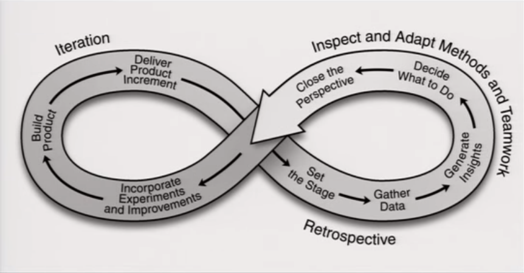

Restrospective are a critical thing to a critial practice to bring to an agile project, because they are so tied of the principle of inspect and adapt we inspect and adapt our code when we do demonstrations when we review our code, when we test our code. Retrospective are the way we inspect and adapt our methods our engeniiening practices and our team work.

During the retrospective we fo through five sirt of chunk of work, that the group needs to do in order to have a successful retrospective.

- Set the stage
    - Getting everybody's head in the room;
    - Doing the things that help get the things going;
- Gather Data
    - Very often we start making decisions about what we want to change or not change;
    - Looking at the data first
    - This phrase is a very important one, whant we have data about facts that things that happened during the iteration and how we responded to those things that happen;
- Generate insights
    - What the data means for us;
    - We have these response or reactions, this happened as result of that, what does mean for use;
- Decide what to do
    - What do we want to do the same or differently or what else new things do we want to try in our next iteration
    - So then we get decided what to do 
- Close the retrospective
    - We recap what we decided, we do the retrospective about the retrospective
    - Figure out how we can improve the retrospective, then move to the planning.

References:
https://www.youtube.com/watch?v=w8w-dFrmovQ