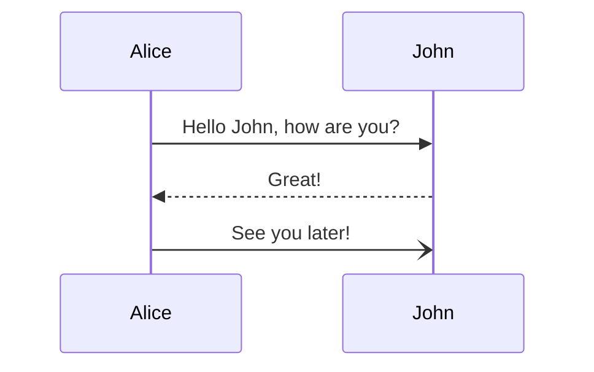

- Gwan: Proposal, session
- Learn how JEDIS does things
- Pex: Try to learn for long time but haven't touch anything yet
- Job: Wee Shen don't approve
- Nat: Everything is slow motion, we discuss as monolith, I can feel a monolith discussion in JEDIS, miss a lot of innovation, code standards and innovation. Demotivate changes, but continuous improvement was a great action
- Kiang-SELFIS: spend 50%/50% between JEDIS and dotRez. In dotRez is a little more free to make changes, need to drive a lot to make changes and proposal, to make it accepted. Because without governance you are going to lose the control. And who is in position, not really a microservices. How to solve that
code review: code review are longs and we don't have document in the changes

- JEDIS is quite difficult and hard to write, some over engineer code.
- Eric: things we like: great improvements in the culture, safe environment to share ideas and still safe. We have constant improvements, during the pull request

- a bit slow -

autonomous team ->

- high: have Eric in the team so don't have too much opportunity to

- bumbim: the last release, speak as Job sometimes:

- IQ: has a lot of support from apple. relationship wiith JEDIS was simple and anything was smooth, advice: don't be afraid to code in JEDIS and

- Further questions:
