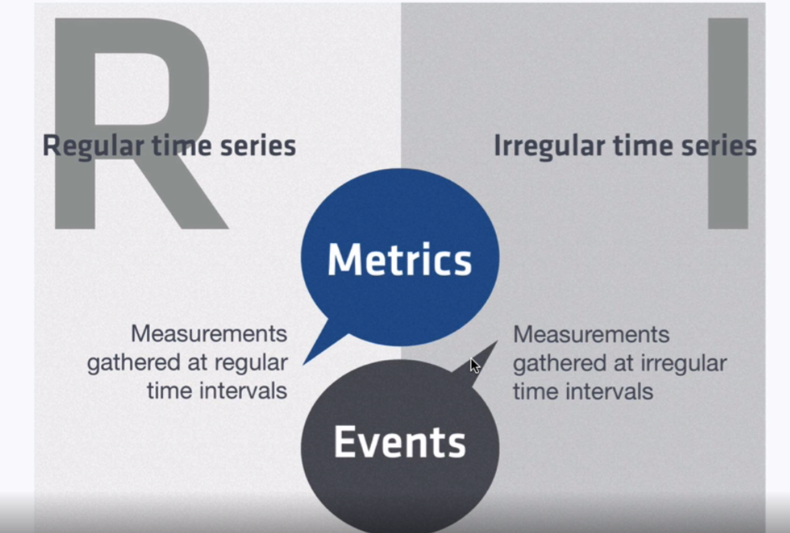
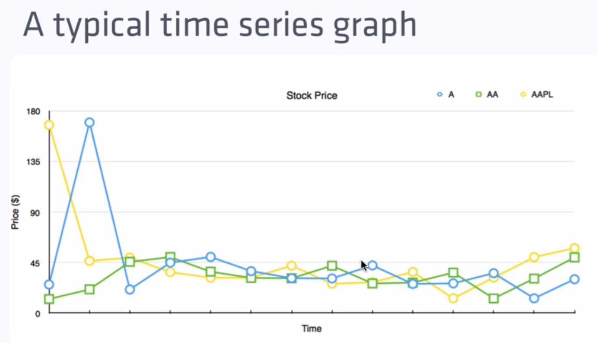

## What a Time series data is:

- A sequence of data points. Typically consisting of a successive measurements made from the same source over a time interval
- Plot the points on a graph and one of your axes would always be time.

### Regular vs Irregular Timeseries

Also known as Metrics (regular) and Events (irregular)

### Summarization of Events

- Events become regular time intervals, for example

> Summarizing the avarage trad price of Apple stock every 10 minutes over the course of the day.

> Summarizing the average response time for requests in an application over 1 minute intervals.

## What a Time Serie Database is:

- Optimized for collection, storing, retriving & processing of time series data.

Compared this to:
- Document database
    - Optimized for storing documents
- Search databases
    - Optomized for full-text searches
- Traditional Relational
    - Databases optimized for the tabular storage of related data in rows & columns

### What makes time-series unique

- Time-series workload
    - Lifecycle management;
    - Summarization
    - Large range scans of many records

### Some databases used for time-series

Other dbs
- Cassandra, MongoDB, Elastic, Redis

Time-series dbs
- Kx, OpenTSDB, Graphite, Riak, Prometheus

## Primary Use Cases

- IOT
    - Industrial settings: smart roads, agriculture, oil and gas
    - CosumerL wearables, consumer devices
- DevOps
    - Custom monitoring: Server, VM's, applications
- Real-time Analytics
    - Apps that instrument business, social or development metrics in real-time

## Why Choose InfluxDB

- Easy to get started with;
- Familiar query syntax;
- No external dependencies;
- Allows for regular and irregular time series;
- Horizontally scalable;
- Member of a cohesive time series platform;

## Influx DB Data Model

How do we represent points textually? - Why not JSON? => Performance issue serializing and desserializing JSON

The Line Prototol

`measurement,tagset fieldset timestamp`

`stock_price,ticker=A,market=NASDAQ price=177.03 14452992000000000`

A serie in InfluxDB

measurement + tagset = The series as a whole

measurement + tagset + timestamp = Single point

#### Examples of points in Line Protocol

`cpu,host=server1 value=100 144529920000000000`

`temperature,zipcode=94107,country=usa value=75,humidity=10` => We do not put timestamp here, then InfluxDB will use the timestamp when save the request

`response_time,method=GET,precision=ms value=12i 144529920000000000`

### Influx CLI

#### Insert Data

`insert cpu...`

#### Reading

`SELECT * FROM cpu`

`SHOW SERIES`

`SHOW MEASUREMENTS`