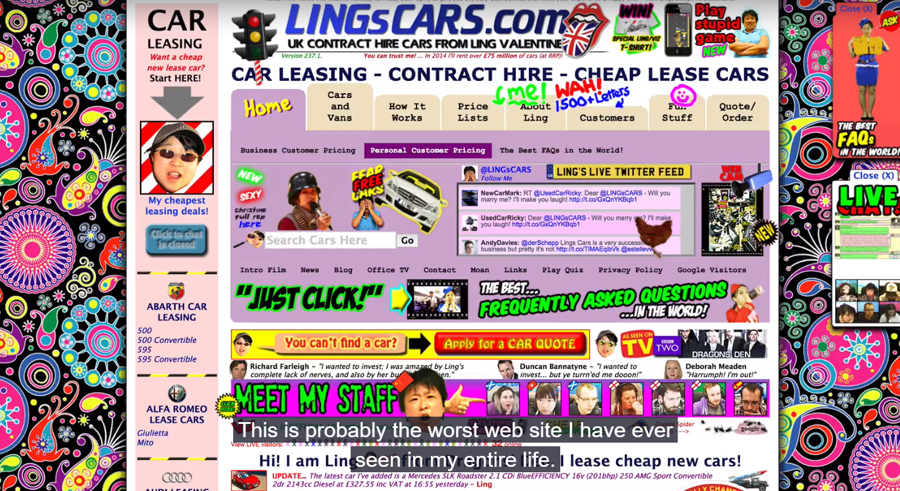
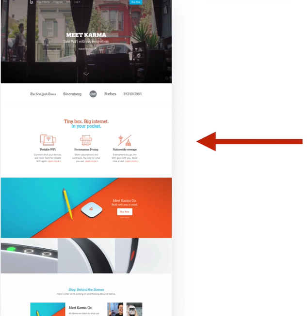

# Web Design for Web Developers: Build Beautiful Websites!

The lines between designers and developers are becoming more blurred.

Flat design is a big new design trend popularized by Microsoft and Apple.

## Beautiful Typography

Typography is an essential part of any design. Good typography can make avery design look professional.

1. Use a font-size between 15 and 25 px for body text.


2. Use REALLY BIG font-sizes for headlines


Sometimes when you use such a big headline you will want to decrease the font weight of that text, this ensure that the text doesn't steal too much intention from the rest of the content and makes the text look more modern and elegant.


3. Use line spacing between 120% and 150% of the font-size

Line spacing make text easy to read


When you define a small or none line spacing, you see a big block of text whic is not easy to ready because the lines are almost overlap.

Now with a big line spacing, it is not pleasant to read the text because it's way to spaced out.


4. 45 to 90 characters per line

That is easy to read 45 to 90 characters per line.


5. Use good fonts

Sans-serif x Serif


### Sans-Serif Example


Sans-serif recomendations in Google font.


### Serif Example


Serif recomendations in Google font.


## How to choose a font?

1. Chose a font which reflects the look and feel you want for your site.
2. Decide: sans-serif or serif typeface?
3. Use a good font
4. Use only that one typeface (fpr beginners)

## Using Colors like a pro

Don't do like that.



1. Use only one base color

You can use [https://flatuicolors.com/](https://flatuicolors.com/) to choose you base color.


And beside choosing a base color you can also create a darker or lighter version of that color. Doing so you can create a nice color pallete. The gray tones are not considered base colors here.


You can use [http://www.0to255.com](http://www.0to255.com) to create a light and dark color from your base color.

2. Use a tool if you want to use more colors

If you want to mix multiple color, I recommend to use a color wheel tool like:

- [https://color.adobe.com/create/color-wheel/](https://color.adobe.com/create/color-wheel/)
- [http://www.paletton.com/](http://www.paletton.com/)

This tools use color theory to choose the best color combinations for you.

You can then use a main color to get attention to the most important elements on your web page like that, and the second or third color can compliment the main color:


You can see in zendesk that the main color is clearly green, but they have a nice orange (secondary color) to draw attention to the button.

3. Use color to draw attention

When you are in doubt about using colors and don't know where to use colors and how often, just pick a color and it stands out and use it mostly to draw attention to a button or any other element of importance on your Web site, look this example:

 

 4. Never use black in your design

 Never choose a black color for any part of your design. This is because black actually almost never appears in the real world using complete black just doesn't feel natural.

 5. Choose colors wisely

 Pick the right color in order to get the desired response from your audience, color makes difference, this happens because there are psychological defects behind each color.

 - red: power, passion, strength and excitement
 - orange: draws attention without be overpowering as red. It means cheerfulness (alegria) and creativity, friendliness, confidence and courage.
 - yellow: is energetic and gives the feeling of happiness and loveliness, curiosity, inteligence and brightness
 - green: is the color of harmony, nature, life and heath, money. In design green can have a balancing and harmonizing effect.
 - blue: patience, peace, trustworthiness (confiabilidade) and stability, it is one of the most beloved colors especially by man. IT is associated with professionalism, trust and honor (because this facebook pick this color)
 - purple: knowability and wealth, wisdom, royalty, nobility and luxury and mistery
 - pink: romance, passivity, care, peace, affection
 - brown: relaxation and confidence, earthness, nature, durability, comfort, and reliability.

 ## Working With Images

In fact using large background images can make your website look more attractive and create more user engagement. Putting text over image

1. Put text directly on the image


The easiest way is to put text diretly on an image, the problem is that it only works if the image is quite dark and the text is white. In this website we can see that we don't have enough contrast between the headline and the image, it make the text hard to read.

2. Overlay the image

It is a good solution for the previous problem. You can overlay the image with a color, the most usual and of course simple to use is black, making the image darker.


But we also can use other colors.


3. Put your text in a box


The box should be opaque

4. Blur the image


You can blur the whole image or just a part, just make sure the text still in the blur part of the image.

5. The floor fade

Floor fate is a techinique where an image studdenly fades towards black at the bottom


## Using CSS to Work with Images

### Overlay the image

```css
.darken {
    background-image: linear-gradient(rgba(0, 0, 0, 0.5), rgba(0, 0, 0, 0.5)), url(YOUR IMAGE HERE);
}
```

Example: http://jsfiddle.net/drpak8vy/1/


### Put text in a box

```css
.text-box {
    background-color: rgba(0, 0, 0, 0.5);
    color: #fff;
    display: inline;
    padding: 10px;
}
```

Example: http://jsfiddle.net/qg83m36p/

### Floor fade

```css
.floor-fade {
    background: linear-gradient(to bottom, rgba(0, 0, 0, 0), rgba(0, 0, 0, 0.6) ), url(YOUR IMAGE HERE);
}
```

Example: http://jsfiddle.net/gRzPF/409/

## Icons

Icons can be a very important task of the web design work, they have a lot of power. Some guidelines to use icons are:

1. Use icons to list features/steps

You can use icons to use features of your website or steps for the user archive some goal, icons help user to get an idea what is the website is about.


2. Use icons for actions and links

Popular websites like facebook and youtube use icons in the navigation links.


If you use icons for it, there are two rules:

- Your icons should be instantaneously recognizable and remove open interpretation
- Label your icon if you have enough space, becuase otherwise you can confuse your users.

3. Icons should NOT take the big point of design, it should support the design

In this example, you can see only three icons, that support the design listing the features of the product.



4. Use icon fonts whenever possible

Use icon fonts, because vector scale up and down.

